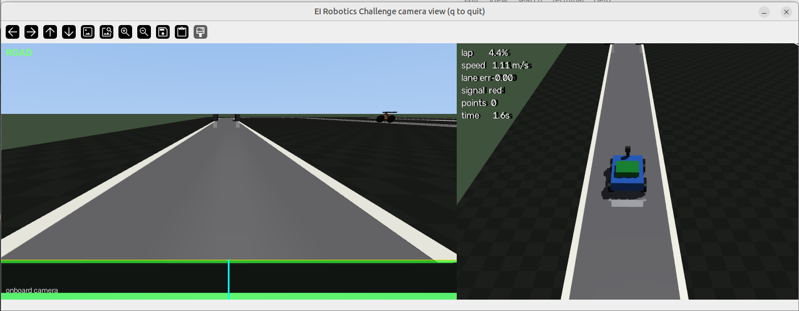
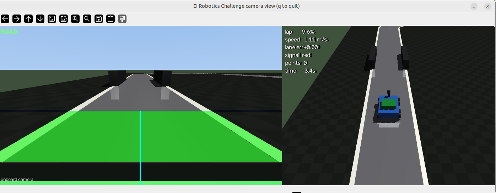
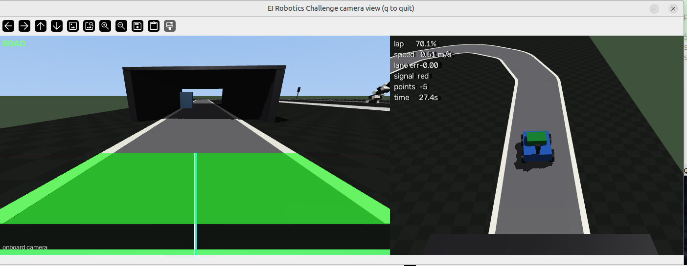

# EI Robotics Challenge — Line-Following Simulator

A MuJoCo simulation of the **EI Robotics Challenge** autonomous line-following
course. The real event runs on physical Rubik Pi vehicles; this repo lets teams
learn the course, prototype vision and control, and practice before hardware day.



*`python examples/view_camera.py`: the onboard camera with the line-detection
overlay — green = detected road, cyan = the column the follower steers toward —
beside a behind-the-car chase view.*

The track follows the supplied multi-level diagram: a paved strip with white
edges winds through every challenge section in a roughly 9.7 m × 6.7 m
simulation footprint:

```
       start ── lane keeping ── choke ────────────────┐
       ▲                                             │
  traffic light                                      ▼
       │    checkerboard gate / speed ◄────── bicycle ┘
       │
       │    glare ────────────────────────────────┐
       │                                         winding turn
       └──── tunnel #2 (dark + overturned car) ◄───────────┘
```

Driving order: **start → lane keeping → choke → first descent → second turn →
middle speed straight with the dynamic bicycle halfway along it → checkerboard
gate → high glare → winding return → tunnel #2 → traffic light → finish**.

An attempt ends after one complete lap. Teams get 3 attempts; the fastest valid
lap wins. Scoring is penalties only — each penalty point adds **1 second** to
the recorded lap time at the finish. Hitting track structure forfeits the
attempt.

## Quickstart

```bash
python3 -m venv .venv
source .venv/bin/activate
pip install -e .

# feel the course with your keyboard (arrows; space = stop; backspace = reset)
python examples/drive_keyboard.py

# watch the reference controller drive a clean lap (uses privileged info)
python examples/run_example_controller.py

# the real thing: camera-based line following
python examples/vision_lane_keeper.py

# SEE what the camera sees, with the line-detection overlay
pip install -e ".[viz]"        # one-time: adds OpenCV
python examples/view_camera.py

# headless (no graphics window; camera rendering still needs OpenGL)
MUJOCO_GL=osmesa python examples/vision_lane_keeper.py --headless --seed 3
```

## Rules (simulation)

Faithful to the official guidelines wherever they can be auto-judged:

- **Primary metric: lap time.** `env.score.result()` reports `lap_time`
  (or `None` if forfeited). At the finish, **1 s is added per penalty point**
  (e.g. −10 points → +10 s).
- **Sensors match the hardware rules.** Camera (primary), IMU, wheel
  encoders, steering feedback. **Depth sensors are prohibited** at the real
  event, so the sim has none — obstacle detection must come from the camera.
- **Vehicle matches the Rubik Pi class**: ~22 × 16 cm, ~1 kg, Ackermann
  steering, rear-wheel drive, ~2.2 m/s top speed.

| points | event |
|---|---|
| −2 | leaving the track, once per incident until the car returns |
| −5 | stalling >2 s |
| −10 | crossing the traffic-light stop line on red |
| −15 | contact with an obstacle |
| forfeit | collision with track structure, flip, lap timeout |

Point values live in `challenge/scoring.py`.

## Writing your controller

```python
from challenge import ChallengeEnv

env = ChallengeEnv(render_mode="human")
obs, info = env.reset(seed=0)
while True:
    action = my_brain(obs, info)          # -> [steer, throttle] in [-1, 1]
    obs, reward, terminated, truncated, info = env.step(action)
    if terminated or truncated:
        break
print(env.score.summary())
```

**Action** — 2 floats in [-1, 1]: `[steering (+1 = left), throttle (+1 ≈ 2.2 m/s)]`.

**Observation** — 8 floats, only what the real robot senses on-board:

| index | meaning |
|---|---|
| 0 | forward speed from wheel encoders (m/s) |
| 1–2 | longitudinal / lateral acceleration (m/s², body frame) |
| 3 | yaw rate (rad/s) |
| 4 | steering angle (rad) |
| 5–6 | rear wheel angular velocities (rad/s) |
| 7 | elapsed time (s) |

**Camera** — `env.camera_image()` returns the onboard RGB frame. This is the
competition's primary sensor for line following and obstacle detection. Run
`python examples/view_camera.py` to watch that feed live with the
line-detection overlay (green = detected line pixels, cyan = the column the
follower steers toward) next to a behind-the-car chase view.

The course is deliberately hostile to naive vision:

- the **glare straight** washes the floor out to near-white (fixed thresholds
  die here — see the adaptive threshold in `vision_lane_keeper.py`),
- the **checkerboard gate** adds high-contrast structure over the road,
- **tunnel #2** is genuinely dark,
- the tunnel mouth mixes bright and dark content in one frame,
- the roadside signal follows a 6 s green / 2 s yellow / 4 s red cycle, and
  its starting phase randomizes each `reset()`.

The overlay makes these hazards concrete — the checkerboard gate and the dark
tunnel each break a fixed brightness threshold in a different way:



*Passing through the checkerboard gate — high-contrast structure laid over the road.*



*Approaching the dark tunnel #2, with the upside-down car obstacle inside.*

**`info["privileged"]`** — ground truth (pose, arc length, lateral offset,
obstacle positions) that the real robot will **not** have. Use it to get
moving on day one; replace each use with perception before the real event.
Both example controllers label exactly where they cheat.

## Project layout

```
challenge/
  track.py           track geometry: centerline math, section positions —
                     shared by the XML generator and the env
  generate_track.py  writes assets/challenge.xml (python -m challenge.generate_track)
  env.py             ChallengeEnv — reset/step API and rules enforcement
  scoring.py         penalty values and the attempt result
  assets/
    challenge.xml    the generated course
    car.xml          the Rubik Pi-class car (camera, IMU, encoders)
examples/
  drive_keyboard.py          drive manually to learn the course
  example_controller.py      pure-pursuit reference using privileged info
  run_example_controller.py  runs the reference controller
  vision_lane_keeper.py      camera-based line following — the real approach
                             (obstacle/stop/signal logic still privileged)
  view_camera.py             live onboard-camera view with the line-detection
                             overlay + chase view (needs the [viz] extra)
tests/                       unit tests for track, env, and controllers
```

## Notes for teams

- **Every attempt differs**: obstacle side/crossing phase and your staging
  position randomize on `reset()`. The official track layout is only revealed
  on competition day — don't overfit; `track.py` makes it easy to build
  variant layouts.
- **The env is Gymnasium-shaped** (`reset`/`step`, 5-tuple) with no Gymnasium
  dependency; RL teams can wrap it in a few lines. `step` returns a shaped
  reward (arc-length progress + scaled scoring events).
- **Physics at 500 Hz, control at 50 Hz.** Vision at 25 Hz (every other
  control step) is a realistic processing budget for embedded hardware.
- **Customizing**: geometry in `challenge/track.py` + `generate_track.py`
  (rerun the generator), rules/timing constants at the top of
  `challenge/env.py`, point values in `challenge/scoring.py`.

## License

This project is released under the [MIT License](LICENSE).
